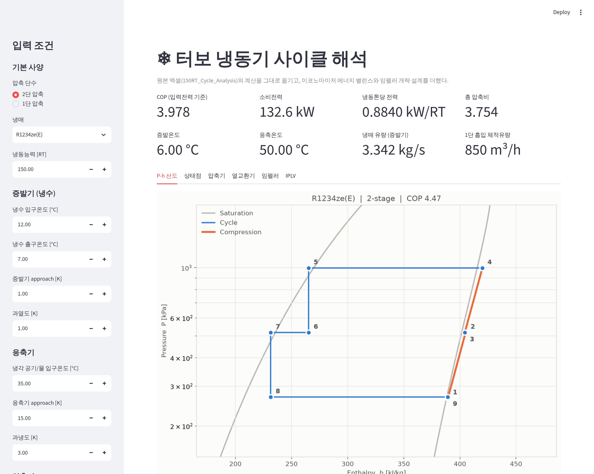

# 터보 냉동기 사이클 해석 프로그램

`150RT_Cycle_Analysis` 엑셀의 계산을 파이썬 프로그램으로 옮긴 것이다.
엑셀에서 REFPROP / CoolProp 애드인으로 하던 냉매 물성 계산을
**CoolProp** 라이브러리가 대신하므로, 엑셀 애드인 없이도 돌아간다.

할 수 있는 것

- 1단 / 2단(+서브콘덴서) 압축 사이클 해석 — 상태점, 동력, COP, 토출온도
- 최대 응축온도 조건에서의 보호 설계점 (최대 토출온도·동력)
- 열교환기 2차측 유량 · LMTD · UA
- **터보 압축기 임펠러 개략 치수** (회전수, 외경, 주속, 마하수)
- IPLV(부분부하 효율)
- P-h 선도 그림

---

## 0. 제일 쉬운 방법 — 두 번 클릭

파이썬만 깔려 있으면 아래 파일을 **두 번 클릭**하면 끝이다.
필요한 라이브러리를 알아서 깔고 브라우저까지 열어준다 (처음 한 번만 몇 분 걸린다).

| 운영체제 | 실행할 파일 |
|----------|-------------|
| 윈도우 | `실행_윈도우.bat` |
| 맥 | `실행_맥.command` |

> 맥에서 "보안 때문에 열 수 없음" 이 뜨면
> **시스템 설정 → 개인정보 보호 및 보안 → "확인 없이 열기"** 를 누르면 된다.
>
> 검은 창이 같이 뜨는데, **프로그램이 도는 창이라 닫으면 안 된다.**
> 끝낼 때는 그 창에서 `Ctrl+C`(맥은 `Control+C`)를 누른다.

아래는 직접 명령어를 쳐서 쓰는 방법이다.

---

## 1. 설치 — 처음 한 번만

파이썬이 없으면 먼저 [python.org](https://www.python.org/downloads/) 에서 받아 설치한다.
설치할 때 **"Add Python to PATH"** 를 꼭 체크한다.

그다음 터미널(윈도우는 `명령 프롬프트` 또는 `PowerShell`)을 열고,
이 폴더로 이동한 뒤 아래 한 줄을 친다.

```bash
pip install -r requirements.txt
```

몇 분 걸린다. 끝나면 준비 완료다.

---

## 2. 쓰는 방법 — 셋 중 편한 것으로

### (가) 웹 화면으로 쓰기 — 코드를 몰라도 되는 방법

```bash
streamlit run app.py
```

브라우저가 뜨고, 왼쪽에서 냉매·능력·온도를 바꾸면 결과가 바로 갱신된다.
표는 CSV 로 내려받을 수 있다.



### (나) 입력 파일로 돌리기

`examples/` 안에 예제가 4개 있다.

| 파일 | 내용 |
|------|------|
| `150RT_1stage_R1234ze.yaml` | 1단 압축 (엑셀 1STG 시트 재현) |
| `150RT_2stage_R1234ze.yaml` | 2단 + 서브콘덴서 (엑셀 2STG 시트 재현) |
| `200RT_2stage_R134a.yaml` | R134a 200RT (엑셀 134a 시트 재현) |
| `150RT_2stage_권장.yaml` | **위 2단 조건을 바로잡은 설정** — 실제 설계에는 이쪽을 쓸 것 |

메모장으로 열어 숫자만 고친 뒤:

```bash
python -m turbochiller examples/150RT_2stage_R1234ze.yaml
```

옵션을 붙일 수도 있다.

```bash
python -m turbochiller examples/150RT_2stage_R1234ze.yaml --iplv --impeller
python -m turbochiller --refrigerant R134a --capacity 200 --stages 2 --t-cond 45
python -m turbochiller --help
```

### (다) 파이썬 코드에서 직접 쓰기

```python
from turbochiller import CycleInput, two_stage, format_report

inp = CycleInput(
    refrigerant="R1234ze(E)",
    capacity_rt=150,
    chilled_water_out=7.0,    # 냉수 출구
    evap_approach=1.0,        # -> 증발온도 6°C
    cooling_medium_in=35.0,   # 공랭 입구
    cond_approach=15.0,       # -> 응축온도 50°C
    eta_is_stage1=0.80,
    eta_is_stage2=0.80,
)
res = two_stage(inp)
print(format_report(res))
print(f"COP = {res.cop:.3f}, 소비전력 = {res.input_power:.1f} kW")
```

---

## 3. 계산 내용

### 상태점 번호 (2단 압축)

엑셀 시트와 번호가 같다.

| No | 위치 |
|----|------|
| 1 | 1단 압축기 흡입 |
| 2 | 1단 토출 |
| 3 | 2단 흡입 (서브콘덴서 증기와 혼합된 뒤) |
| 4 | 2단 토출 |
| 5 | 응축기 출구 (과냉액) |
| 6 | 서브콘덴서 입구 (중간압까지 팽창) |
| 7 | 서브콘덴서 액 출구 |
| 8 | 증발기 입구 (팽창 후) |
| 9 | 증발기 출구 |

### 압축 계산

단열효율로 실제 토출 상태를 잡는다.

```
s1 = s(T1, P1)
Δh_단열  = h(s1, P2) − h1
Δh_실제  = Δh_단열 / η_단열
T2       = T(h1 + Δh_실제, P2)
```

### 임펠러 개략 치수

단열 헤드와 흡입 체적유량에서 무차원수로 1차 근사를 낸다.

```
u2 = √(Δh_단열 / ψ)          ψ : 압력계수 (후향깃 0.55~0.62)
ω  = Ns · Δh_단열^0.75 / √Q   Ns : 비속도 (최적 0.6~0.8)
D2 = 2·u2 / ω
```

통상 설계 범위를 벗어나면 경고가 뜬다.
**어디까지나 초기 치수 잡기용이고, 실제 설계는 깃 형상·확산기·CFD 로 다시 확인해야 한다.**

---

## 4. 원본 엑셀과 다른 점

엑셀 값을 그대로 재현하는지 `tests/test_excel_reference.py` 로 검증했다
(3개 시트 모두 0.2% 이내 일치).

다만 계산상 손봐야 할 곳 몇 군데는 **기본값을 고쳐 두었다.**
엑셀과 숫자를 한 줄씩 맞춰볼 때는 `--excel-compat` 옵션(웹 화면에서는
'엑셀 호환 모드' 체크박스)을 켜면 원래대로 계산한다.

| 항목 | 엑셀 | 이 프로그램의 기본값 |
|------|------|---------------------|
| 2단 흡입 혼합 | 온도 가중평균 | **엔탈피 가중평균** (에너지 보존에 맞음) |
| 2단 응축 열량 | 1단 유량만 사용 | **전체 유량 (1+x)·ṁ** 사용 |
| 중간단 유량비 x | 손으로 지정 (0.2 / 0.1) | **이코노마이저 에너지 밸런스로 계산** |
| 중간압 | 온도를 손으로 지정 | **√(P1·P2)** 로 자동 (원하면 직접 지정) |

자세한 내용과 근거는 [`docs/모델_설명.md`](docs/모델_설명.md) 에 정리해 두었다.

### 에너지 수지 오차

결과에 `에너지 수지 오차` 가 같이 나온다. `Qc − Qe − W` 가 0 이어야 정상이다.

- 유량비를 손으로 지정하면 (엑셀 방식) 약 **4%** 오차가 난다 → 자동으로 두면 0 이 된다
- 배관 압력손실을 등온으로 모델링해서 생기는 0.05% 정도의 오차는 정상이다

---

## 5. 테스트

```bash
pytest
```

- `tests/test_excel_reference.py` — 엑셀 3개 시트의 값과 대조
- `tests/test_cycle.py` — 에너지 보존, 입력 검증, 임펠러 관계식
- `tests/test_app.py` — 웹 화면이 예외 없이 뜨는지

---

## 6. 폴더 구조

```
turbochiller/
  props.py       냉매 물성 (CoolProp 감싸기)
  cycle.py       1단 / 2단 사이클 해석          ← 계산의 핵심
  hx.py          열교환기 2차측 LMTD / UA
  impeller.py    임펠러 개략 치수
  standards.py   AHRI 550/590 조건표, IPLV
  plot.py        P-h 선도
  report.py      결과 출력 서식
  config.py      입력 파일 읽기/쓰기
  cli.py         명령줄 실행기
app.py           웹 화면 (streamlit)
examples/        입력 파일 예시 3개 (엑셀 시트 3개에 대응)
tests/           검증 테스트
docs/            모델 설명
```

## 쓸 수 있는 냉매

`R1234ze(E)`, `R134a`, `R1234yf`, `R513A.mix`, `R1233zd(E)`, `R245fa`, `R1336mzz(Z)` 등
CoolProp 이 아는 냉매는 모두 쓸 수 있다.
